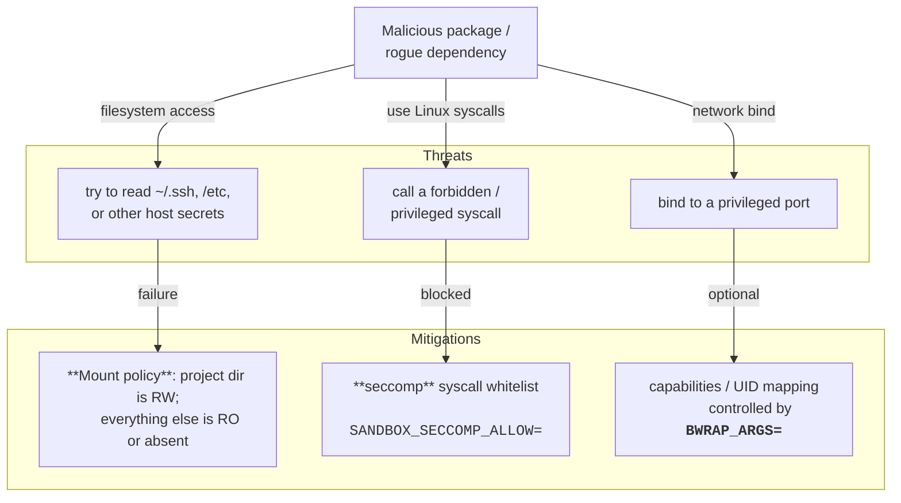

sandbox-venv: secure container virtualenv wrapper
=================================================

[](https://github.com/kernc/sandbox-venv/actions)
[](https://github.com/kernc/sandbox-venv)
[](https://ghloc.vercel.app/kernc/sandbox-venv)
[](https://github.com/kernc/sandbox-venv)
[](https://github.com/kernc/sandbox-venv/issues)
[](https://github.com/sponsors/kernc)


#### Problem statement

Python virtual environments (package
[`virtualenv`](https://virtualenv.pypa.io/en/latest/)
or built-in module
[venv](https://docs.python.org/3/library/venv.html))
isolate your project’s interpreter and dependencies, but they offer
**no security or execution sandboxing** like a virtual machine or a Docker
container would. Therefore, running virtualenv Python programs as-is (unsecured),
**any [rogue dependency](https://www.google.com/search?q=malicious+python+packages&tbm=nws)\*
🎯 or [hacked library code](https://www.google.com/search?q=(hacked+OR+hijacked+OR+backdoored+OR+"supply+chain+attack")+(npm+OR+pypi)&tbm=nws&num=100)
:pirate_flag: ([et cet.](https://slsa.dev/spec/draft/threats-overview) :warning:)
can wreak havoc, including access all your private parts** :bangbang:—think
current user's credentials and personal bits like:
* `~/.ssh/id_ed25519`,
* `~/.pki/nssdb/`,
* `~/.mozilla/firefox/<profile>/key4.db`,
* `~/.mozilla/firefox/<profile>/formhistory.sqlite` ...

<sub>✱ Installing something as seemingly harmless as the popular **package _poetry_**
pulls in [nearly a hundred dependencies or over 70 MB](doc/deps-stats.txt)
of Python sources! 😬</sub>

In someone else's words:

>> Using virtualenv is more secure?
> 
> [No. Not in the slightest.](https://www.reddit.com/r/Python/comments/5sm6zm/using_virtualenv_is_more_secure/)

#### Solution

In order to execute installed Python programs in secure virtual environments,
one is better advised to either look to OS VM primitives like those provided by Docker
and [containers](https://github.com/containers/), e.g.:
```shell
podman run -it -v .:/src python:3 bash  # ...
```
The simpler alternative is **automatic lightweight container wrapping with
[bubblewrap](https://github.com/containers/bubblewrap)** (of
[Flatpak](https://en.wikipedia.org/wiki/Flatpak) fame)
using `sandbox-venv` script from this repo.


Installation
------------
There are **no dependencies other than a POSIX shell** with
[its standard set of utilities](https://en.wikipedia.org/wiki/List_of_POSIX_commands)
**and `bubblewrap`**.
The installation process, as well as the script runtime,
should behave similarly on all relevant compute platforms,
including GNU/Linux and even
[Windos/WSL](https://learn.microsoft.com/en-us/windows/wsl/install). 🤞

```shell
# Install the few, unlikely to be missing dependencies, e.g.
sudo apt install coreutils binutils bubblewrap libseccomp2 python3
# A working XDG Desktop Portal is recommended to xdg-open hyperlinks
sudo apt install xdg-dbus-proxy xdg-desktop-portal*  # Note: only need one

# Download the script and put it somewhere on PATH
curl -vL 'https://bit.ly/sandbox-venv' | sudo tee /usr/local/bin/sandbox-venv
sudo chmod +x /usr/local/bin/sandbox-venv  # Mark executable

sandbox-venv --help
# Usage: sandbox-venv [VENV_DIR] [BWRAP_OPTS]
sandbox-venv path/to/my-project/.venv
```

Usage
-----
Whenever you create a new virtual environment,
simply invoke `sandbox-venv` on it afterwards, e.g.:
```shell
cd project
python -m venv .venv  # Create a new project virtualenv
sandbox-venv .venv    # Passing virtualenv dir is optional; defaults to ".venv"
```
From now on, directory _.venv_ and everything under it
(in particular, everything in the _bin_ folder,
e.g. `.venv/bin/python`, `.venv/bin/pip` etc.)
sets up and transparently runs in a secure container sandbox.


#### Extra Bubblewrap arguments

Other than the optional virtualenv dir, **all arguments** initially passed to
`sandbox-venv` are **forwarded to bubblewrap**. See `bubblewrap --help` or
[`man 1 bwrap`](https://manpages.debian.org/unstable/bwrap).

You can also pass additional bubblewrap arguments to individual
process invocations via **`$BWRAP_ARGS` environment variable**. E.g.:

```sh
BWRAP_ARGS='--bind /lib /lib' \
    python -c 'import os; print(os.listdir("/lib"))'
```

Note, a **[`.env` file](https://stackoverflow.com/questions/68267862/what-is-an-env-or-dotenv-file-exactly)
at project root** is sourced for the initial environment.

See more specific examples below.


#### Filesystem mounts

The directory that contains your venv dir, i.e. `.venv/..` or
**the project directory, is mounted with read-write permissions**,
while everything else (including `project/.git`)
is mounted read-only. In addition:

* `"$venv/home"` is bind-mounted as `"$HOME"`,
* `"$venv/cache"` is bind-mounted as `"$HOME/.cache"`,
* `"$HOME/.cache/pip"` is bind-mounted as `"$HOME/.cache/pip"`
  (only if environment variable `SANDBOX_USE_PIP_CACHE=` is set as this may
  enable cache poisoning attacks).

To mount extra endpoints, use Bubblewrap switches `--bind` or `--bind-ro`.
Anything else not explicitly mounted by an extra CLI switch
is lost upon container termination.


#### Linux Seccomp

Linux kernel `seccomp` facility for restricting syscalls is
**automatically enabled when the appropriate package is
available**—`apt install libseccomp2 python3-seccomp` (requires virtualenv with `--system-site-packages`)
or `pip install pyseccomp` (also requires `libseccomp2`).
The initializing module `sitecustomize.py` installs a filter
that thereafter only allows syscalls listed in the environment variable
`SANDBOX_SECCOMP_ALLOW=`
(or, by default, some 200 syscalls that should cover all non-special cases).
You can populate the variable at runtime with a custom, stricter syscalls list
or set it to blank
(i.e. `export SANDBOX_SECCOMP_ALLOW=`) to force-disable seccomp completely.


#### Runtime monitoring

If **environment variable `VERBOSE=`** is set to a non-empty value,
the full `bwrap` command line is emitted to stderr before execution.

You can list bubblewraped processes using the
[command `lsns`](https://manpages.debian.org/unstable/lsns)
or the following shell function:

```sh
list_bwrap () { lsns -u -W | { IFS= read header; echo "$header"; grep bwrap; }; }

list_bwrap  # Function call
```

You can run `$venv/bin/shell` to spawn **interactive shell inside the sandbox**.


#### Environment variables

* `BWRAP_ARGS=`– Extra arguments passed to `bwrap` process; space or line-delimited (if arguments such as paths themselves contain spaces).
* `SANDBOX_SECCOMP_ALLOW=`– Space-separated list of system calls allowed by the installed Linux seccomp filter. Requires `libseccomp2` and `python3-seccomp` / Python package `pyseccomp`
* `SANDBOX_USE_PIP_CACHE=`– Mount current user's `$HOME/.cache/pip` inside the sandbox. Insecure, but can be used to cache large, trusted package downloads. Otherwise, pip is always invoked with a clean cache as if `pip --no-cache-dir ...` were used.
* `VERBOSE=`– Print full `exec bwrap` command line right before execution.


#### Debugging

To see what's failing, run the sandbox with something like `strace -f -e '%file,%process' ...`.


Examples
--------
The examples here deal in environment variables,
but once configurations stabilize, you should probably use
`sandbox-venv` **init params** and/or **`.env` files**.

To install a heavy package that requires a compiler, it is often easiest to
supply it with full _/usr_ and _/lib_:
```sh
BWRAP_ARGS='--ro-bind /usr /usr --ro-bind /lib /lib'  pip install ...
```

You *may need* to expose your complex IDE bin/lib dirs.
For use with JetBrains IDEs such as PyCharm, you need to give the
sandbox access to the IDE runtime dir. We show this done globally
at **initialization via default args** rather than via `$BWRAP_ARGS` variable:
```sh
IDE_DIR="/home/my_username/Downloads/pycharm"  # E.g.
sandbox-venv .venv --ro-bind "$IDE_DIR" "$IDE_DIR"
```

To pass extra environment variables, other than those filtered by default,
use `bwrap --setenv`, e.g.:
```sh
BWRAP_ARGS='--setenv OPENAI_API_KEY c4f3b4b3'  my-ai-prog
# or a .env (dotenv) file
```

To run the sandboxed process as **superuser**
(while still retaining all the security functionality of the container sandbox),
e.g. to open privileged ports, use args:
```sh
BWRAP_ARGS='--uid 0 --cap-add cap_net_bind_service'  python -m http.server 80
```

To run **GUI (X11) apps**, some prior success was achieved using e.g.:
```sh
BWRAP_ARGS='--bind /tmp/.X11-unix/X0 /tmp/.X11-unix/X8 --setenv DISPLAY :8' \
    python -m tkinter
```
See [more examples on the ArchWiki](https://wiki.archlinux.org/title/Bubblewrap#Using_X11).


Security Model
--------------
Entrypoints in `$venv/bin` are wrapped with `exec bwrap`
so that every invocation runs inside a **fresh** Bubblewrap container.

In addition, `$venv/bin/pip` wrapper re-wraps any **newly installed executables** in `$venv/bin`,
ensuring they always use the wrapped `$venv/bin/python`.

Rather than giving the sandbox full filesystem access,
minimal shared library (`*.so`) dependencies,
as well as specific host binaries (e.g. `/usr/bin/python3`, `/usr/bin/git`, `/bin/sh` etc.),
are collected and made available inside the container.
**Most paths are bind-mounted read-only**, while the **current working directory**
is mounted with **RW** permissions (with the exclusion of
directories `.venv` and `.git`, which are layered over RO so as to not allow
the sandboxed executable to modify them directly).

**`BWRAP_ARGS=`** environment variable lets you **expand or relax the sandbox** at runtime.

Additional [confinement with `seccomp` is available](#linux-seccomp).

**Paths inside the sandbox mirror the host paths**, potentially exposing your username,
directory layout etc. This was done for simplicity—pull requests to solve paths anonymization are greatly appreciated!




Contributing
------------
You see a mistake—you fix it. Thanks!


Alternatives
------------
1. A popular alternative are the aforementioned Docker/OCI containers
   and manual management of their runtime. This comes free when the
   worked on project itself deals in
   [Continerfiles](https://manpages.debian.org/unstable/Containerfile). 
2. [`sandbox-run`](https://github.com/sandbox-utils/sandbox-run),
   a similar bubblewrap-based shell script to sandbox arbitrary executables.
3. On Linux, [AppArmor](https://apparmor.net), even with
   [apparmor.d](https://github.com/roddhjav/apparmor.d)
   applied, doesn't ship a generic `python` profile, so one would go
   through explicit `aa-exec --profile my-custom-env`, but writing
   custom AppArmor profiles is less common than simply using containers.
4. [Firejail](https://github.com/netblue30/firejail/).
   An indie C project with virtually no dependencies (which
   [<del>Red Hat</del><ins>IBM</ins> has a perfectly reasonable position on](https://github.com/containers/bubblewrap?tab=readme-ov-file#related-project-comparison-firejail))
   that sets up its own sandbox. I guess it's a matter of trust.
   Similarly to AppArmor, requires writing a custom profile.
5. A custom
   [`seccomp` initialization script](https://healeycodes.com/running-untrusted-python-code),
   executed at interpreter startup using
   [~~`PYTHONSTARTUP=`~~](https://docs.python.org/3/using/cmdline.html#envvar-PYTHONSTARTUP)
   [`sitecustomize`](https://docs.python.org/3/library/site.html#module-sitecustomize)
   startup hook.
6. On macOS, [`sandbox-exec`](https://igorstechnoclub.com/sandbox-exec/)
   or Apple Containerization®.

In comparison to the above, `sandbox-venv` is like `chroot` on steroids.
It uses the same isolation primitives that containers use
(process sandbox via Linux namespaces, isolated filesystem view),
but without all of the container runtime baggage ... YMMV.
